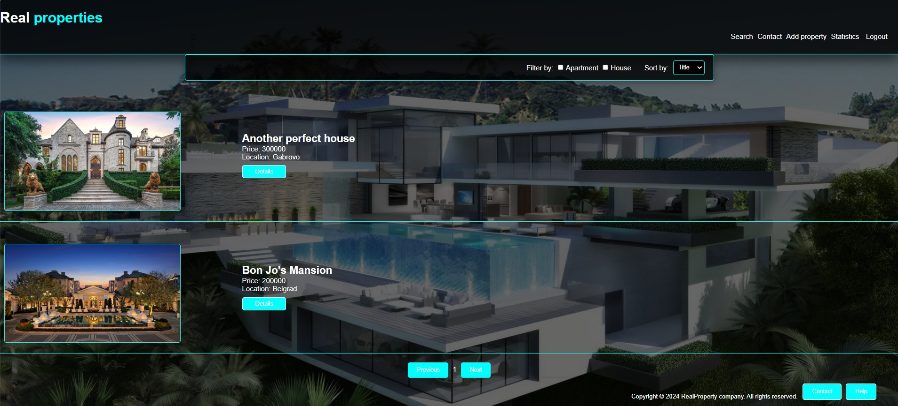
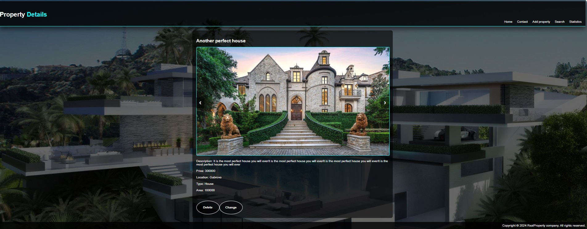
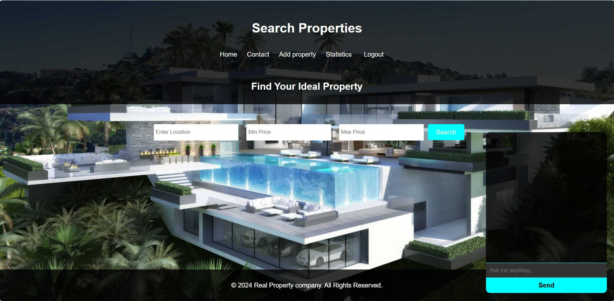
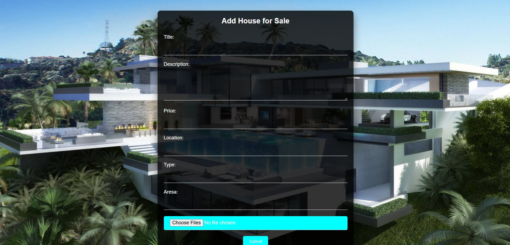
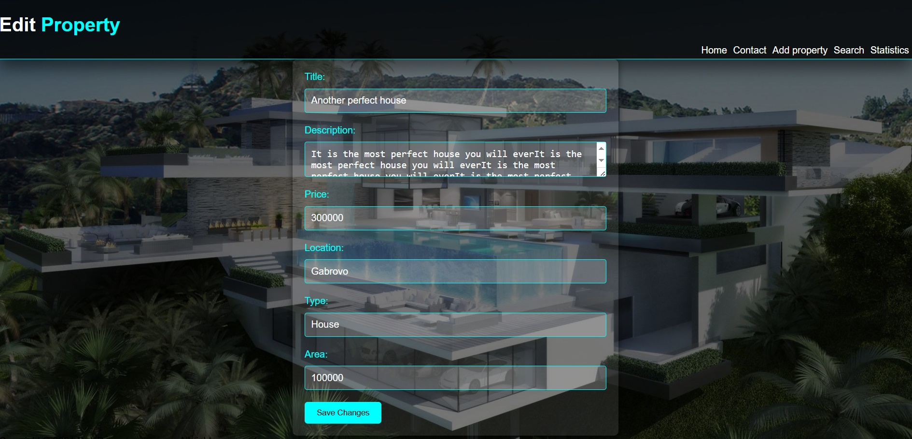
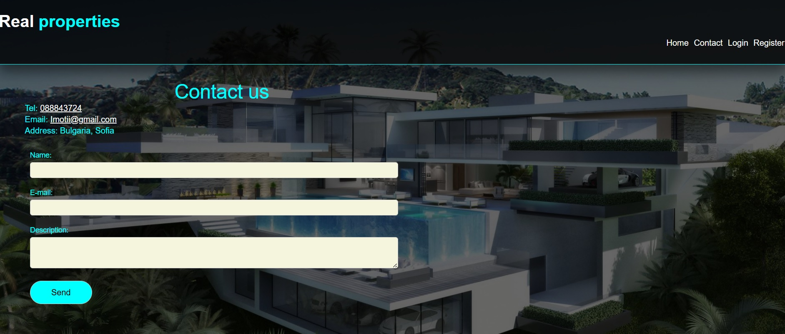
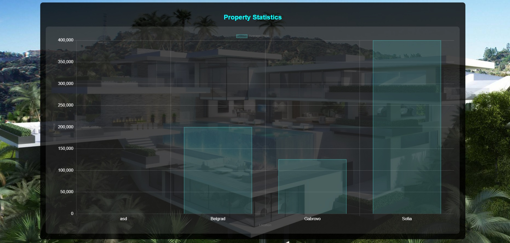

# Real Estate Property Management Platform

## Overview

The **Real Estate Property Management Platform** is a web-based application designed to facilitate the buying, selling, and management of properties. The platform offers a user-friendly interface for property owners to list their properties, while prospective buyers can search, filter, and view property listings based on various criteria. The system includes robust user authentication, property management features, and a statistics page for analyzing property data. The application leverages Firebase for backend services, including authentication, data storage, and real-time database management.

## Features

### User Management
- **User Registration**: Users can register with a username, email, and password. Managed through Firebase Authentication.
- **User Login**: Registered users can log in using their email and password.
- **User Profile Management**: Users can update their profile information and reset passwords.

### Property Management
- **Add Property**: Users can add property listings with details like title, description, price, location, and type (house or apartment).
- **Edit Property**: Users can edit their own property listings.
- **Delete Property**: Users can delete their own property listings.
- **View Properties**: All users can view and explore property listings.

### Search and Filtering
- **Search Properties**: Search by location, minimum price, and maximum price.
- **Filter Properties**: Filter by property type (house or apartment).
- **Sorting**: Sort listings by title, price, and date.
- **Chatbot Assistance**: The search page integrates a chatbot powered by OpenAI's API, offering users assistance in finding properties. Users can ask the chatbot questions about available properties, filtering options, and more. This feature enhances the user experience by providing quick answers and guidance.

### Statistics Page
- **Property Statistics**: Visual representation of property prices across locations.
- **Chart Representation**: Data visualization using charts (e.g., bar or line charts).

### Contact Page
- **User Contact Form**: A form to send inquiries or feedback.
- **Help and Support**: A section for help and support information.

## Screenshots

### 1. Main Page (Property Listings)

*The main page where users can view all available property listings, complete with search and filtering options.*

### 2. Property Details Page

*Detailed view of a selected property, showcasing its title, description, price, location, and other relevant information.*

### 3. Search Page (with Chatbot)

*The search page featuring a chatbot that assists users in finding the right property by answering questions and providing suggestions.*

### 4. Add Property Page

*Page where users can add new properties to the platform by filling out a form with property details.*

### 5. Edit Property Page

*Page for editing existing property listings, allowing users to update details like price, description, and location.*

### 6. Contact Us Page

*Form where users can submit inquiries or feedback directly to the platform administrators.*

### 7. Statistics Page

*Page displaying property statistics through various charts, helping users analyze trends and make informed decisions.*

## Non-Functional Requirements

### Performance
- The application loads quickly and supports a high number of concurrent users.
- Optimized Firebase real-time database for quick operations.

### Scalability
- The platform scales to accommodate growing numbers of users and listings.
- Firebase infrastructure ensures scalability.

### Security
- Secure storage of user data via Firebase Authentication.
- Access control ensures only property owners can modify or delete their listings.
- Encrypted data communication using HTTPS.

### Usability
- Intuitive user interface with responsive design for various devices.
- Form validation to prevent invalid data entries.

### Maintainability
- Modular and well-documented codebase for easy maintenance and updates.
- Organized Firebase functions and cloud storage.

### Reliability
- High availability with Firebase providing redundancy and backups.
- Robust error handling for unexpected issues.

## Project Modules

1. **User Authentication Module**: Manages user registration, login, and profile updates via Firebase Authentication.
2. **Property Management Module**: Handles property listing, editing, deletion, and viewing.
3. **Search and Filtering Module**: Implements search, filtering, and sorting functionality, including chatbot integration.
4. **Statistics Module**: Displays property statistics using data visualization tools.
5. **Contact Module**: Facilitates user inquiries and support.

# Real Estate Property Management Platform - User Stories

## User Management

1. **User Registration**
   - **As a new user, I want to register with my email and password so that I can create an account and access the platform.**

2. **User Login**
   - **As a registered user, I want to log in with my email and password so that I can access my account and manage my properties.**

3. **User Profile Management**
   - **As a logged-in user, I want to update my profile information so that I can keep my contact details current.**
   - **As a logged-in user, I want to reset my password if I forget it so that I can regain access to my account.**

## Property Management

4. **Add Property**
   - **As a property owner, I want to add a new property listing so that potential buyers can view and inquire about it.**

5. **Edit Property**
   - **As a property owner, I want to edit the details of my property listing so that I can provide up-to-date information to potential buyers.**

6. **Delete Property**
   - **As a property owner, I want to delete my property listing so that it no longer appears on the platform.**

7. **View Properties**
   - **As a user, I want to browse all available property listings so that I can find a property that meets my needs.**

## Search and Filtering

8. **Search Properties**
   - **As a user, I want to search for properties by location, price, and type so that I can find properties that match my criteria.**

9. **Filter Properties**
   - **As a user, I want to filter property listings by type (house or apartment) so that I can narrow down the list of properties that interest me.**

10. **Sort Properties**
    - **As a user, I want to sort property listings by price, date, or title so that I can easily find the most relevant listings.**

11. **Chatbot Assistance**
    - **As a user, I want to interact with a chatbot on the search page so that I can get help finding properties and answering questions quickly.**

## Statistics

12. **View Property Statistics**
    - **As a user, I want to view statistical data on property prices across different locations so that I can make informed decisions about buying or selling properties.**

13. **Chart Representation**
    - **As a user, I want to see property statistics represented in charts so that I can visually understand market trends.**

## Contact and Support

14. **Contact Form**
    - **As a user, I want to send inquiries or feedback through a contact form so that I can communicate with the platform administrators.**

15. **Help and Support**
    - **As a user, I want to access a help and support section so that I can find answers to common questions and issues.**

## Non-Functional Requirements (Implicit in User Stories)

16. **Performance**
    - **As a user, I want the platform to load quickly and operate smoothly so that I have a seamless experience.**

17. **Security**
    - **As a user, I want my data to be securely stored and transmitted so that my personal information is protected.**

18. **Scalability**
    - **As an admin, I want the platform to scale effectively as more users and properties are added so that the system remains stable and efficient.**

19. **Usability**
    - **As a user, I want the platform to be intuitive and easy to navigate so that I can complete tasks without difficulty.**

## Deployment and Maintenance

20. **Firebase Deployment**
    - **As a developer, I want to deploy the platform on Firebase so that it is accessible online and leverages Firebase's backend services.**

21. **Testing and Optimization**
    - **As a developer, I want to test and optimize the platform before launching it so that it performs well and provides a good user experience.**

## Deployment on Firebase

### Steps for Deployment:

1. **Set Up Firebase Hosting**: Deploy the web application using Firebase Hosting.
2. **Configure Firebase Authentication**: Set up Firebase Authentication for user management.
3. **Set Up Firebase Firestore/Realtime Database**: Store property data and user information.
4. **Testing and Optimization**: Test and optimize the application post-deployment.
5. **Final Launch**: Finalize deployment and go live.